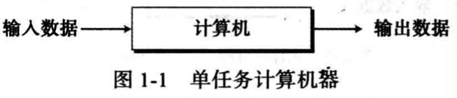
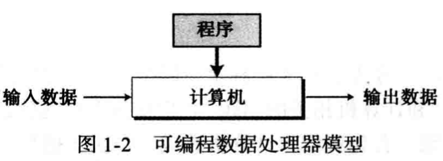
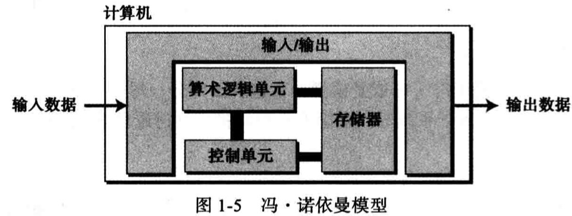

# 绪论

## 1.1 图灵模型
Alan Turing 在1937年首次提出了一个通用计算设备的设想。他设想所有的计算都可能在一种特殊的机器上执行，这就是现在所说的图灵机。
### 1.1.1 数据处理器
在讨论图灵模型之前，让我们吧计算机定义成一个数据处理器。按照这种，计算机就可以被看作是一个接受输入数据、处理数据并产生输出数据的黑盒。

### 1.1.2 可编程数据处理器
图灵模型是一个适用于通用计算机的更好模型。该模型添加了一个额外的元素--程序到不同的计算器中。程序是用来告诉计算机对数据进行处理的指令集合。

在这个图灵模型中，数据数据是依赖两方面因素的结合作用：输入数据和程序。相同数据不同程序和不同数据相同数据都会产生不同的输出数据，只有相同数据相同程序才会输出结果一致。
### 1.1.3 通用图灵机
通用图灵机是对现代计算机的首次描述，该机器只提供了合适的程序就能做任何运算。可以证明，一台很强大的计算机和通用图灵机一样能进行同样的运算。我们所需要的仅仅是为这两者提供数据以及用于描述如何做运算的程序。实际上，通用图灵机能做任何可计算的运算。
## 1.2 冯·诺依曼模型
基于通用图灵机建造的计算机都是在存储器中存储数据。在1944～1945年期间，冯·诺依曼指出，鉴于程序和数据在逻辑上是相同的，因此程序也能存储在计算机的存储器中。
### 1.2.1 4个子系统
基于冯·诺依曼模型建造的计算机分为4个子系统：存储器、算术逻辑单元、控制单元和输入/输出单元

1. 存储器
存储器是用来存储的区域，在计算机的处理过程中存储器用来存储数据和程序
2. 算术逻辑单元
算术逻辑单元（ALU）是用来计算和逻辑运算的地方。
3. 控制单元
控制单元是对存储器、算术逻辑单元、输入/输出等子系统进行控制操作的单元。
4. 输入/输出
输入子系统负责从计算机外部接受输入收据和程序；输入子系统负责将计算机的处理结果输出到计算机外部。
### 1.2.2 存储程序概念
冯·诺依曼模型中要求程序必须存储在内存中。
现在计算机的存储单元用来存储程序及其响应数据。这意味着数据和程序应该具有相同的格式，这是因为他们都存储在存储器中。实际上它们都是以位模式（0和1序列）存储在内存中的。
### 1.2.3 指令的顺序执行
冯·诺依曼模型中的一段程序是又一组数量有限的指令组成。按照这个模型，控制单元从内存中提取一条指令，解释指令，接着执行指令。换句话说，指令就一条接着一条地顺序执行，当然，一条指令可能会请求控制单元以便跳转到其前面或者后面的指令去执行，但是这并不意味着指令没有按照顺序来执行。指令的执行顺序执行基于冯·诺依曼模型的初始条件。当今的计算机以最高效的顺序来执行程序。
## 1.3 计算机组成部分
我们可以认为计算机由三大部分组成：计算机硬件、数据和计算机软件。
### 1.3.1 计算机硬件
当今的计算机硬件基于冯·诺依曼模型，且包含四部分，尽管可以有不同类型的存储单元，不同的输入/输出子系统等。
### 1.3.2 数据
冯·诺依曼模型清楚地将一台计算机定义为一台数据处理机。他接收输入数据，处理并输出相应的结果。
1. 存储数据
冯·诺依曼模型并没有定义数据如何存储在计算机中。如果一台计算机是一台电子设备，最好的数据存储方式应该是电子信号，例如以电子信号的出现和消失的特定方式来存储数据，这意味着一台计算可以以两种状态之一的形式来存储数据。
显然，在日常使用的数据并不是以两种形态之一的形式存在，例如，我们在数字系统中使用的数字可以是0～9十种状态中的任何一个，但你不能（至少目前为止）将这类信息存储到计算机内部，除非将这类信息变成另一种只使用两种状态（0和1）的系统。其他类型的数据（例如文本、图像、声音、视频）同理需要转变成合适的形式（0和1序列）。
2. 组织数据
尽管数据只能以一种形式（位模式）存储在计算机内部，但在计算机外部却可以表现为不同的形式。另外，计算机（以及数据处理表示法）开创了一门新兴的研究领域---数据组织。在讲数据存储到计算机中之前，能否有效的将数据组织成不同的实体和格式？如今，数据并不是按照杂乱无章的次序组织信息的。数据被组织成许多小的单元，在有这些小的单元组成更大的单元。
### 1.3.3 计算机软件
图灵或冯·诺依曼模型的主要特征是程序的概念。尽管早期的计算机并没有在计算机的存储器中存储程序，但是他们还是使用了程序的概念。编程在早期的计算机中体现为系列开关的打开或闭合以及配线的改变。编程在数据实际开始处理之前是由操作工或工程师完成的一项工作。
1. 程序必须是存储的
冯·诺依曼模型中，这些程序被存储在计算机的存储器中，存储器中不仅要存储数据，还要存储程序
2. 指令的序列
这个模型还要求程序必须是有序的指令集。每一条指令操作一个或者多个数据项。因此，一条指令可以改变它前面指令的作用。
也许我们会问为什么程序必须由不同的指令集组成，答案是重要性。如今，计算机完成成千上万的任务，如果每一项任务的程序都是相对独立而且和其他程序之间没有任何的功用段，编程将会变成一件和困难的事情。图灵和冯·诺依曼通过仔细的定义计算机可以使用不同的指令集，从而使得编程编的相对简单。程序员通过组合这些不同的指令来创建任意数量的程序。每个程序可以是不同指令的不同组合。
3. 算法
要求程序员包含一系列指令使得编程变得可能，但也带来了另外一些使用计算机方面的问题。程序员不仅要了解每条指令所完成的任务，还要知道怎么样将这些指令结合起来完成一些特定的任务。对于一些不同的问题，程序员首先应该以循序渐进的方式来解决问题，接着找到合适的指令（指令序列）来解决问题。这种按步骤解决问题的方法就是所谓的算法。
4. 语言
在计算机时代的早起，只有一种称为机器语言的计算机语言。程序员依靠写指令的方式（使用位模式）来解决问题。但是随着程序越来越大，采用这种模式来编写很长的程序编的单调乏味。计算机科学家们研究出利用符号来代替位模式，就像人们在日常中使用符号（单词）来代替一些常用的指令一样。当然，人们在日常生活中所用的一些符号与计算机中所用的符号不同。这样计算机语言的概念诞生了。自然语言（例如英语）是丰富的语言，并有很多正确组合单词的规则；相对而言，计算机语言只有比较有限的符号和单词。
5. 软件工程
在冯·诺依曼模型中没有定义软件工程，软件工程是指结构化程序的设计和编写。今天，它不仅仅是用来描述完成某一任务的应用程序，还包括程序设计中所有严格遵循的原理和规则。
6. 操作系统
当代计算机发展演变过程中，科学家们发现有一些列指令对所有程序来说是公用的。例如，一条告诉计算机在哪里接受和发送数据的指令在几乎所有的程序中都要用到。如果这些指令只编写一次就可以用于所有程序，那么效率将会大大提高。这样，就出现了操作系统的概念。计算机操作系统最初是为程序员访问计算机部件提供方便的一种管理程序。今天，操作系统所完成的工作远不止这些。
## 1.4 历史
简要回顾一下计算和计算机的历史，分为三个阶段
### 1.4.1 机械计算机器（1930以前）
* 17世纪，法国著名数学家和物理学家布莱斯·帕斯卡（Blaise Pascal）发明了Pascsline，一个用来加减运算的计算器。到了20世纪，当尼克劳斯·沃斯（Niklaus Wirth）发明了一种结构化的程序设计语言，将它命名为Pascal语言，以纪念首位发明机械计算器的科学家。
* 17世纪后期，德国数学家弗里德·莱布尼茨（Gottfried Leibnitz）发明了技能做乘除运算又能做加减运算的一台更加复杂的计算机器。这台机器被称为莱布尼茨之轮。
* 第一台利用存储和编程概念的机器是雅卡尔提花织机（Jacquard loom），它是由约瑟夫-玛丽·雅卡尔（Joseph-Marie Jacquard）在十九世纪初期发明的。这种织布机是利用穿孔卡（类似存储程序）来控制在织布过程中经线的提升。
* 1823年，查尔斯·巴比奇（Charles Babbage）发明了一种差分引擎，它不仅能够很容易地进行数学运算，

